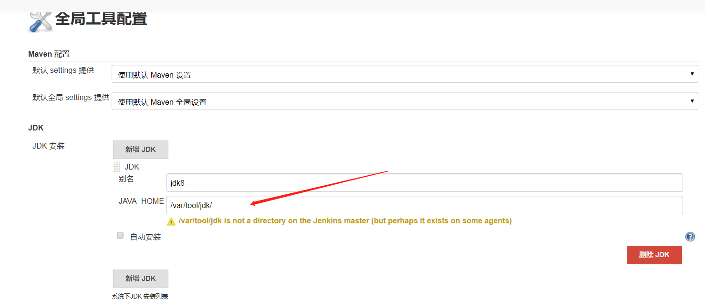

# 1.安装docker
```
#更新yum工具包
yum update

#下载docker
curl -sSL https://get.docker.com/ | sh

#启动docker
systemctl start docker

#查看docker版本
docker --version

#设置开机自启动
systemctl enable docker

#配置docker加速器
cp /lib/systemd/system/docker.service /etc/systemd/system/docker.service
chmod 777 /etc/systemd/system/docker.service
vim /etc/systemd/system/docker.service
ExecStart=/usr/bin/dockerd --registry-mirror=https://kfp63jaj.mirror.aliyuncs.com
systemctl daemon-reload
systemctl restart docker
ps -ef | grep docker

#关闭防火墙
service firewalld stop

```
# 2.安装jenkins
## 2.1 编写jenkins的dockerFile
```
FROM jenkins/jenkins:lts
USER root
RUN echo "> /etc/apt/sources.list.d/jessie-backports.list && wget http://mirrors.163.com/.help/sources.list.jessie -O /etc/apt/sources.list"
RUN apt-get update && apt-get install -y git
```
## 2.2 创建自己的jenkins容器
`docker build -t jenkins_lm .`
# 3. 启动jenkins
## 3.1创建一个文件挂载到jenkins的配置文件上
```
mkdir /var/jenkins_home
chown -R 1000:1000 /var/jenkins_home
```
## 3.2 启动jenkins容器
`docker run -itd -p 8081:8080 --name jenkins --privileged=true -v /home/jenkins_home/:/var/jenkins_home -v ~/.ssh/:/root.ssh jenkin_lm`
# 4. 配置jenkins
## 4.1 配置全局变量
### 4.1.1配置jdk



